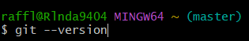
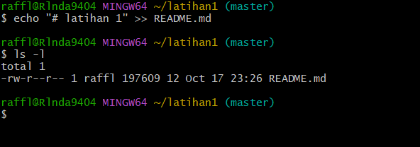
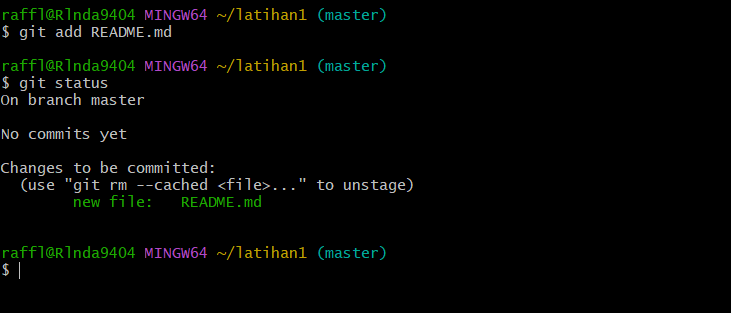
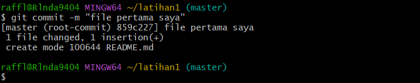

# LatihanVCS
## Belajar dasar git

### Membuat paragraf
kode tag paragraf adalah `
`
ini adalah tampilannya

# instalasi git
- download Git, buka website resminya Git(git-scm.com).

- Kemudian unduh Git sesuai dengan arsitektur komputer kita.Kalau menggunakan 64bit, unduh yang 64bit.
Begitu juga kalau menggunakan 32bit.

- jika sudah terinstal di windows.untuk mencobanya, silahkan buka CMD atau PowerShell kemudian ketik perintah
## Git --version
### ini adalah tampilannya `
`

# Menambahkan Global Config
- Pada saat pertama kali menggunakan git, perlu dilakukan konfigurasi user.name dan user.email

- konfigurasi ini bisa dilakukan untuk global repostiry atau individual repository.

- apabila belum dilakukan konfigurasi, akan mengakibatkan terjadi kegagalan saat menjalankan perintah git commit

- Config Global Repository

### $ git config --global user.name “nama_user”

### $ git config --global user.email “nama_user”

# Perintah Dasar Git
- git init, perintah untuk membuat repository local

- git add, perintah untuk menambahkan file baru, atau perubahan pada file
pada staging sebelum proses commit.

- git commit, perintah untuk menyimpan perubahan kedalam database git.

- git push -u origin master, perintah untuk mengirim perubahan pada
repository local menuju server repository.

- git clone [url], perintah untuk membuat working directory yang diambil dari
repositry sever.

- git remote add origin [url], perintah untuk menambahkan remote
server/reopsitory server pada local repositry (working directory)

- git pull, perintah untuk mengambil/mendownload perubahan terbaru dari
server repository ke local repository

# Membuat reposiory Local
- Buka direktory aktif, misal: d:\labs_pemrograman1 (buka
menggunakan Windows Explorer)

- klik kanan pada direktory aktif tersebut, dan pilih menu Git Bash,
sehingga muncul git bash commad

- Buat direktory project praktikum pertama dengan nama latihan1

### $ mkdir latihan1
### $ cd latihan1

- Sehingga terbentuk satu direktori baru dibawahnya, selanjutnya
masuk kedalam direktori tersebut dengan perintah cd (change
directory)

- direktory aktif menjadi: d:\labs_pemrograman1\latihan1

### $ git init

- Jalankan perintah git init, untuk membuat repository local.

- Repository baru berhasil di inisialisasi, dengan terbentuknya satu
direktori hidden dengan nama .git

- Pada direktori tersebut, semua perubahan pada working directory
akan disimpan.

# Menambahkan File Baru Pada Repository
- Untuk membuat file dapat menggunakan text editor, lalu menyimpan
filenya pada direktori aktif (repository)

- disini kita akan coba buat satu file bernama README.md (text file)

### $ echo “# Latihan 1” >> README.md

- File README.md berhasil dibuat.

### Ini adalah tampilannya

- Untuk menambahkan file yang baru saja dibuat tersebut gunakan
perintah git add.

- File README.md berhasil ditambahkan.

# Commit (Menyimpan Perubahan Ke Database)
- Untuk menyimpan perubahan yang ada kedalam database repository
local, gunakan perintah git commit -m “komentar commit”

### $ git commit -m “File pertama saya”

- Perubahan berhasil disimpan.
